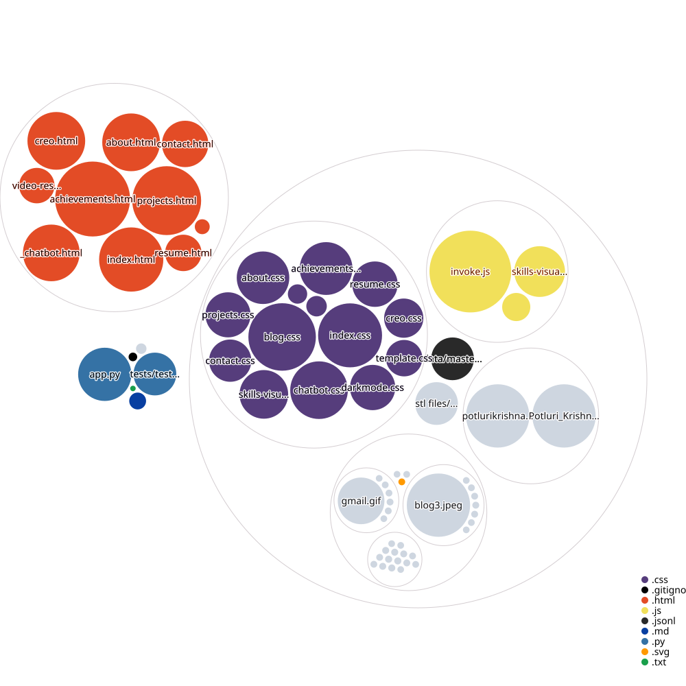

# MyPortFolio

## Local setup

The portfolio's **Ask Me** chatbot uses the Gemini API. Its credentials are
read from the process environment or a local `.env` file; they are never
committed to this repository.

1. Copy `.env.example` to `.env`.
2. Set `GEMINI_API_KEY` to a valid Gemini API key.
3. Start the application with `flask --app app run --debug`.

If a key is already configured as an operating-system environment variable,
you do not need to add it to `.env`. Restart Flask after changing environment
variables so it can load the new value.

## Repo Visualization
 
